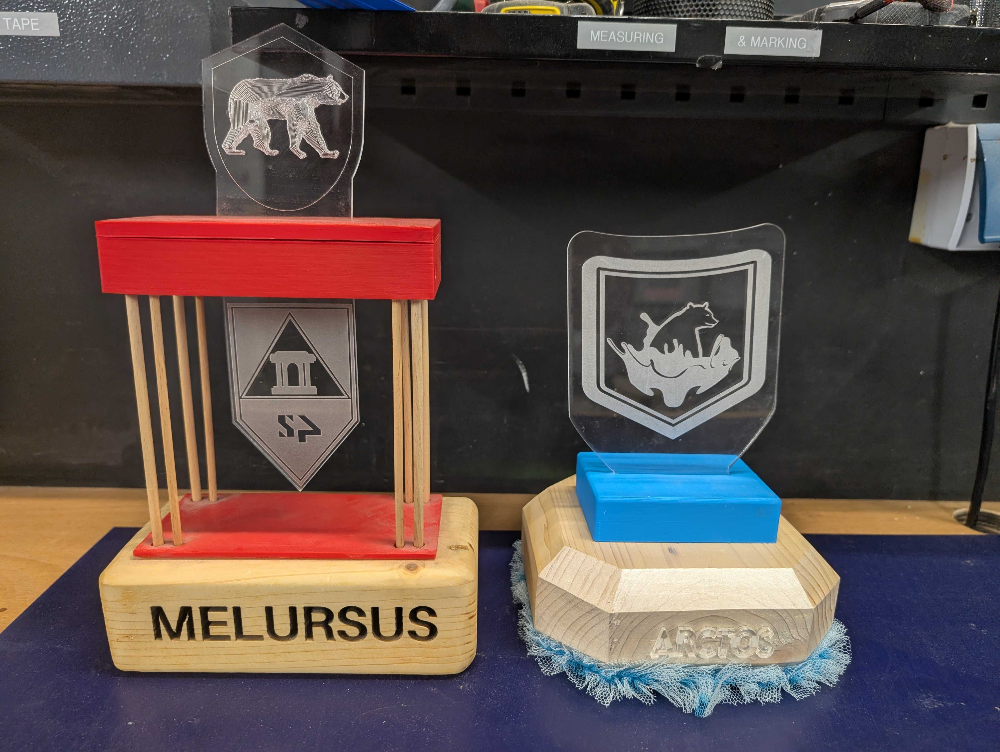

# Maker Trophy Challenge Introduction

Welcome to our FabLab challenge project - to build an edge-lit LED trophy using an element from each of our Maker Basics training sessions: Electronics & Microcontrollers, 3D Printing, Laser Cutting, Woodwork and Textiles.

The aim of the project is to get you comfortable with some of the basic techniques of 'making' and to consider how to combine them. From computer-aided design (CAD), to soldering, working with LED strips and handcrafting, the Maker Trophy is introduced in each of our Maker Basics training sessions, to give you a 'way in'. From there on, you can work on the project in teams or independently and collect stamps for each technique completed. When all the elements are completed, display your meisterwerk in the lab alongside others :)

Each element is designed to be makeable within just a few hours, but the challenge lies in bringing them all together in one object. Feel free to use the elements in this repo 'as is' for practice or get as creative as you like, the choice is yours. After this, we hope you'll have the confidence to work in any of the above areas on your own projects.

To get going, simply let us know when you'd like to start, the names of your team members, then you have one month from that date to complete your final trophies (who doesn't like a deadline?!)

The finished trophy must be entirely your own or your team's work - you can for tech support and demos from the admin team but they shouldn't do any of the work for you!

Finally, free Open-Source Software (FOSS) is strongly preferred and is what we strive to use in the lab as far as possible. The assets in this repo have been produced with this in mind, using Inkscape, FreeCAD and Arduino IDE. These apps are also pre-installed on the main lab PCs.

# The Techniques

See separate REQUIREMENTS.md in each folder below for full details of what's expected:

- [3D Printing](./3DPrinting): 3D print a lightweight base to house your and adapt the design (using FreeCAD)
- [Soldering & Electronics](./Soldering&Electronics): Light an LED strip using an Arduino Nano (using Arduino IDE)
- [Laser Cutting](./LaserCutting): Produce an vector design and cut and engrave it in acrylic (using Inkscape)
- [Woodworking](./Woodworking): Handcraft a wooden base to hold the trophy in place using a block of wood (using sawing, drilling and sanding techniques)
- [Sewing](./Sewing): Sew on a ribbon or add another textiles element (perhaps using a hole in the acrylic)
